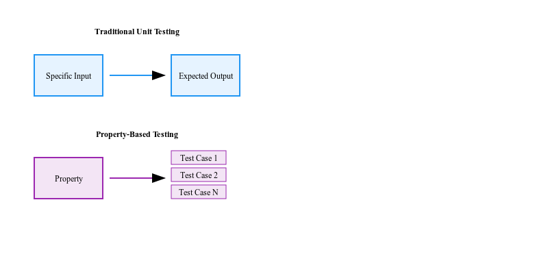

### Introduction
As software grows more complex, traditional example-based testing often fails.
It can't find edge cases and unexpected behaviors. Property-based testing (PBT)
is a powerful alternative. It generates test cases based on properties that
your code should meet without any manual input. This article will explore
property-based testing using jqwik. It's a modern property-based testing library
for Java.

### What is property-based testing?
Property-based testing is a method. Instead of writing specific test cases,
you define properties. Your code must meet them in all cases. The testing
framework then generates many test cases to verify these properties.



For example, instead of writing

```java
@Test
void testReverse() {
    assertEquals("cba", StringUtils.reverse("abc"));
}
```

You would define a property:
```java
@Property
void reverseStringTwiceShouldGiveOriginalString(@ForAll String input) {
    assertEquals(input, StringUtils.reverse(StringUtils.reverse(input)));
}
```

### When to apply property-based testing
Before diving into property-based testing, we must know when it will help the most.
Like mutation testing, property-based testing has limited use with low test coverage.
It might not be worth the investment in some cases.
Property-based testing is best when you have a solid foundation of unit
tests with 80% coverage or higher. This baseline ensures you've handled
the basic scenarios and edge cases in your code. Property-based testing helps you find edge cases your tests might have missed.
Here are scenarios where property-based testing proves particularly valuable:
Code that runs algorithms or transforms data has functions.
They should have properties that hold true for any input.
For instance, property-based testing is great for:
- sorting algorithms
- mathematical computations
- string manipulations

Property-based testing can check invariants in data structures, like
lists and trees. It can also check custom collections. These invariants
should hold true across all states and transitions.
Stateless business logic: use pure functions. They should transform data
without side effects. The lack of state makes it easier to reason about properties and generate more meaningful test cases.
Yet, property-based testing might not be the best fit for:
UI components: user interfaces need scenario-based testing, not property verification.
Heavy I/O operations: code that mainly handles databases, file systems,
or network calls might perform better with traditional integration tests.
Simple CRUD operations: basic create, read, update, delete.
They often don't have complex properties to verify beyond basic validation.
Remember that you should use property-based testing to complement,
not replace, your existing test suite. It's an extra tool in your testing arsenal
that becomes more powerful as your codebase matures and your test coverage improves.


### Access full article





