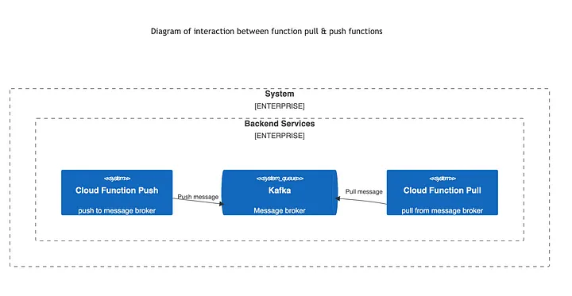

### Introduction
This article will show how to use the Spring Cloud Functions projects. The Spring Cloud Functions is the best approach to implementing a straightforward business logic.
Nowadays, the usage of message brokers such as Kafka has increased.
I will implement a simple system in this article, as shown below.



### Implementation
I will start with a simple example of a cloud function, 
which is the same as a rest endpoint in the classical spring boot web application. 
You can create a project from your favorite IDE or from [Spring Initliazr](https://start.spring.io/).

```xml {filename="pom.xml"}
<?xml version="1.0" encoding="UTF-8"?>
<project xmlns="http://maven.apache.org/POM/4.0.0" xmlns:xsi="http://www.w3.org/2001/XMLSchema-instance"
         xsi:schemaLocation="http://maven.apache.org/POM/4.0.0 https://maven.apache.org/xsd/maven-4.0.0.xsd">
    <modelVersion>4.0.0</modelVersion>
    <parent>
        <groupId>org.springframework.boot</groupId>
        <artifactId>spring-boot-starter-parent</artifactId>
        <version>3.2.1</version>
        <relativePath/> <!-- lookup parent from repository -->
    </parent>
    <groupId>io.vrnsky</groupId>
    <artifactId>cloud-function-push</artifactId>
    <version>0.0.1-SNAPSHOT</version>
    <name>cloud-function-push</name>
    <description>cloud-function-push</description>
    <properties>
        <java.version>17</java.version>
        <spring-cloud.version>2023.0.0</spring-cloud.version>
    </properties>
    <dependencies>
        <dependency>
            <groupId>org.springframework.cloud</groupId>
            <artifactId>spring-cloud-function-context</artifactId>
        </dependency>
        <dependency>
            <groupId>org.springframework.cloud</groupId>
            <artifactId>spring-cloud-starter-function-web</artifactId>
        </dependency>
        <dependency>
            <groupId>org.springframework.boot</groupId>
            <artifactId>spring-boot-starter-test</artifactId>
            <scope>test</scope>
        </dependency>
    </dependencies>
    <dependencyManagement>
        <dependencies>
            <dependency>
                <groupId>org.springframework.cloud</groupId>
                <artifactId>spring-cloud-dependencies</artifactId>
                <version>${spring-cloud.version}</version>
                <type>pom</type>
                <scope>import</scope>
            </dependency>
        </dependencies>
    </dependencyManagement>

    <build>
        <plugins>
            <plugin>
                <groupId>org.springframework.boot</groupId>
                <artifactId>spring-boot-maven-plugin</artifactId>
            </plugin>
        </plugins>
    </build>

</project>
```

Your pom.xml file or build.gradle should like this.

The first step is to describe events related to service. I will stick with the following definition of an event

```java {filename="PullRequestAccepted.java"}
package io.vrnsky.cloudfunctionpush.domain;

import java.util.List;

public record PullRequestAccepted(
        String author,
        List<String> reviewers,
        boolean havePassedAllChecks
) {
}
```
The first step is to describe events related to service. I will stick with the following definition of an event.
The second step is to create a configuration class within the bean function creation inside it.

```java {filename="FunctionConfig.java"}
package io.vrnsky.cloudfunctionpush.config;

import io.vrnsky.cloudfunctionpush.domain.PullRequestAccepted;
import org.springframework.context.annotation.Bean;
import org.springframework.context.annotation.Configuration;

import java.util.function.Function;


@Configuration
public class FunctionConfig {

    @Bean
    public Function<PullRequestAccepted, String> pullRequestAccepted() {
        return value -> """
                Pull request from %s has been reviewed by %s. Have passed all checks: %b
                """
                .formatted(
                        value.author(), 
                        value.reviewers().size(),
                        value.havePassedAllChecks()
                );
    }
}

```

### Access full article


