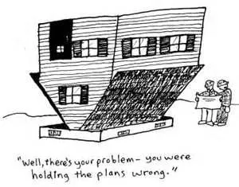

My previous blogpost start from the house picture — as analogy about architecture. But I found some problems with this analogy:

- There is no software construction industry in the same degree that there is for buildings. The building industry has substantial substructure, reflection numerous specialisations, skill sets, training paths, corporate organisations, standards bodies, and regulations. While the software industry has some structure, including that seen in offshore development practices, it is much less differentiated than the building industry
- The discipline off architecture does not have anything akin to the issue of deployment in software: Software is built in one place, but deployed for use in many places, often with specialisation and localisation. Manufactured building, otherwise known as trailers, are somewhat similar, but still there is no corresponding notion to dynamic distributed, mobile architectures, as there is with software
- Software is a machine; building are not (notwithstanding Le Corbusier’s declaration that, “A house is machine for living in”). The dynamic character of software — the observation that led to Edsger Dijkstra’s famous “goto statement considers harmful” paper (Dijkstra 1968), provides a profoundly difficult challenge to designers, for which there is not counterpart in building design

### Fundamental understanding

There are three fundamental understandings of architecture, the recognition of which helps situate architecture with respect to rest of software engineering:

Every application has an architecture
Every application has at least one architect
Architecture is not a phase of development
All applications do have architectures because they all result from key design decision.
The architect is the person, or in most cases, group who makes the principal decisions about applications, who establishes and (it is hoped) maintains the foundational design.
Architecture refers to the conceptual essence of an application, the principal decision regarding its design, the key abstractions that characterise the application.

### Acccess full article


